# A 股月频多因子系统流程图

> 本文是《A 股月频多因子选股与模拟回测实现文档》的配套流程图集。
>
> 图集只展示系统边界、时间关系、状态转移和模块流向，不替代主文档中的规则定义。名词、标签口径和执行约束以主文档为准。
>
> 当前范围是月频决策、月内每日账户处理、模拟撮合和成本后研究回测，不接实盘，不执行真实下单。

## 0. 阅读方法

图中使用三类时间：

```text
as_of_time            可以做出当前决策的时间点
available_at          数据首次可以被策略使用的时间
label_available_at    未来收益标签已经完整实现、可以用于评价或训练的时间
```

最重要的约束只有一条：

```text
信号层只能看到 available_at <= as_of_time 的数据。
执行层只能看到 execution_date 当天实际可用的行情和状态。
未来收益、未来成交结果和未来标签不能反向决定已经发生的决策。
```

一条完整的月度链路是：

```text
月末决策
  -> 下一交易日执行
  -> 月内每日撮合并估值
  -> 下一次月末决策
  -> 本期标签完整结束后，才允许进入后续 IC、训练或评价
```

## 1. 系统总架构

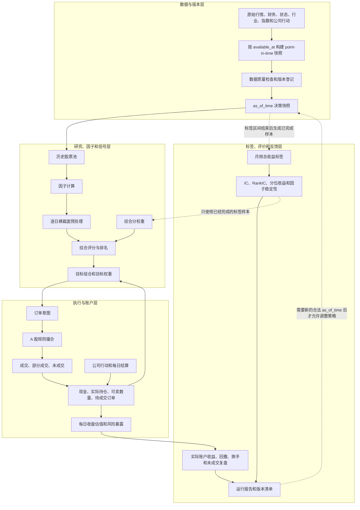

图中的反馈不是“把评价结果塞回本期决策”。评价结果只能在之后的决策时点使用，并且必须满足 `label_available_at <= 新的 as_of_time`。

## 2. 时间对齐和防未来数据

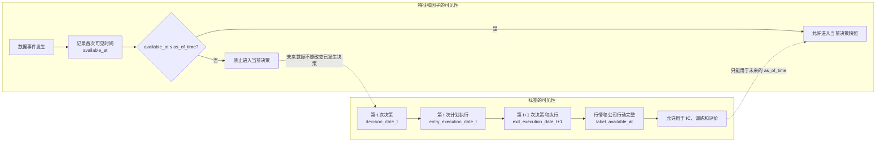

同一个真实时间轴上，行情“已经发生”不等于策略“已经可见”，标签“已经产生”也不等于标签“已经完整”。系统必须分别保存 `available_at` 和 `label_available_at`。

## 3. 月末决策和月内持有的完整时间线

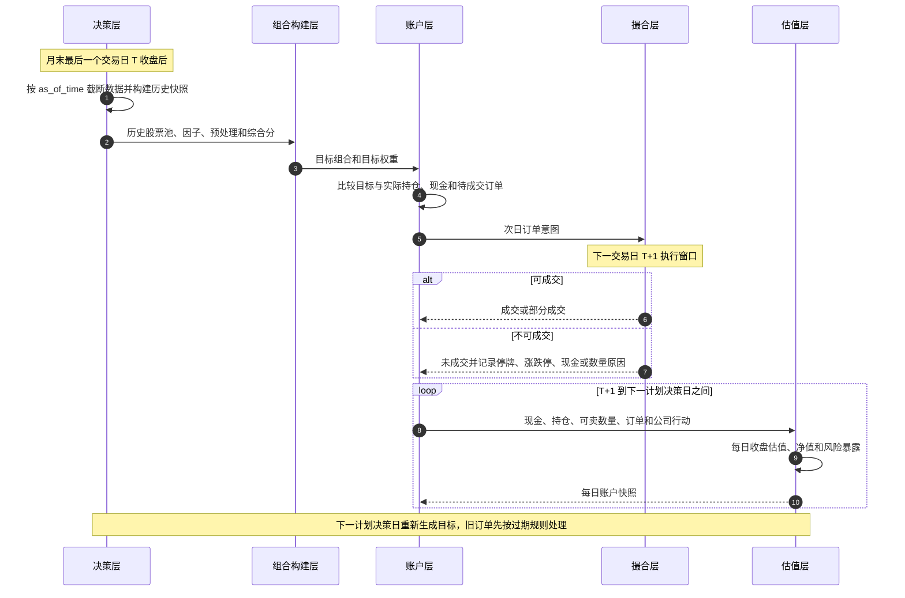

月频策略不代表股票固定持有 20 个交易日。两次决策之间持续持有，下一期重新评分；如果再次入选，可以继续持有。

## 4. 数据接入和质量门禁

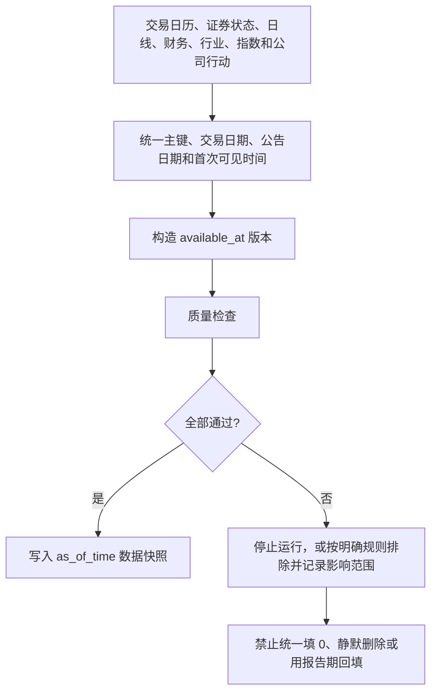

质量门禁至少覆盖：

```text
主键唯一
交易日连续
价格、成交额和市值非负且无明显异常
复权因子和公司行动能对齐
停牌、退市、ST 和板块状态没有缺口
行业和指数成分保留历史版本
财务数据没有未来公告日
因子覆盖率和股票池数量没有异常跳变
```

## 5. 股票池构建和已有持仓处理

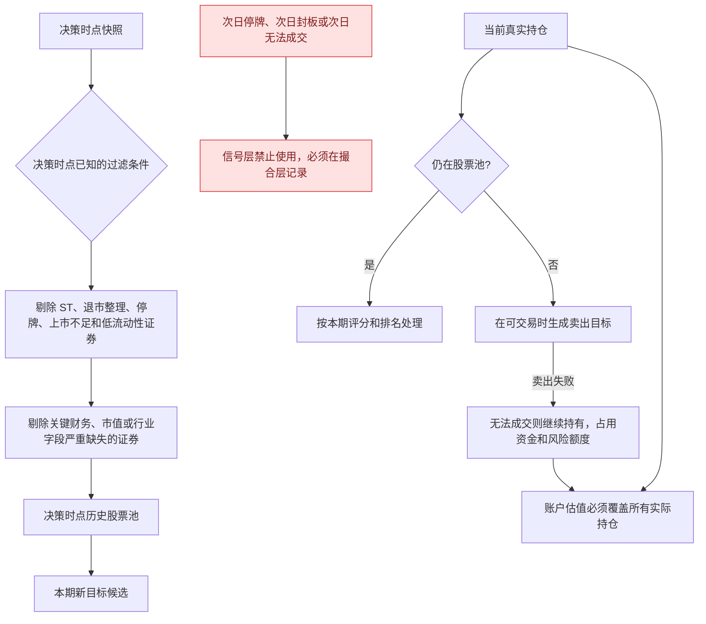

股票池只影响“哪些股票可以被选为目标”和“哪些股票可以生成退出目标”，不会让真实账户中的持仓凭空消失。次日停牌、封板和无法成交只能由撮合层产生结果。

## 6. 因子计算和横截面预处理

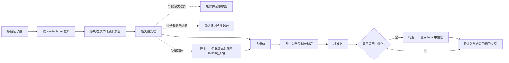

预处理必须逐交易日进行，不能把不同日期的股票混在同一个横截面里。缺失、极值、方向和中性化规则一旦进入正式实验，就必须版本化并冻结。

## 7. 综合评分和 IC 动态权重

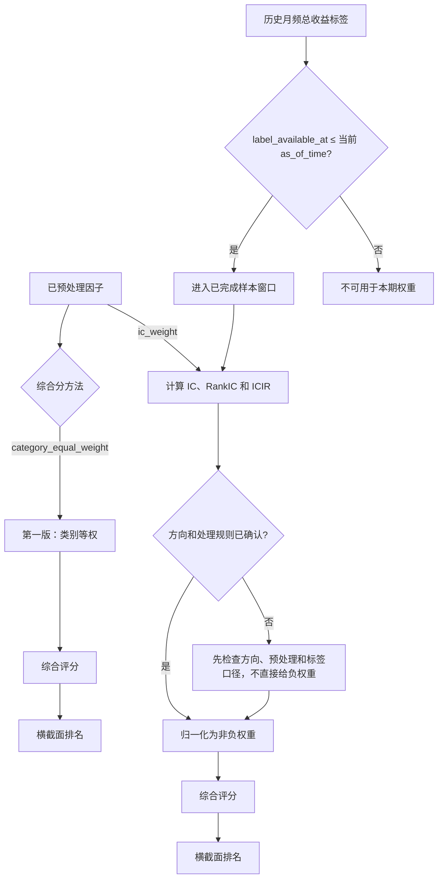

第一版默认使用类别等权，不启用 IC 加权、机器学习或因子择时。后续启用 IC 加权时，只能使用标签区间已经结束的历史样本；固定未来 20 日收益只能做辅助诊断，不能冒充月频调仓标签。

## 8. 目标组合、缓冲和约束

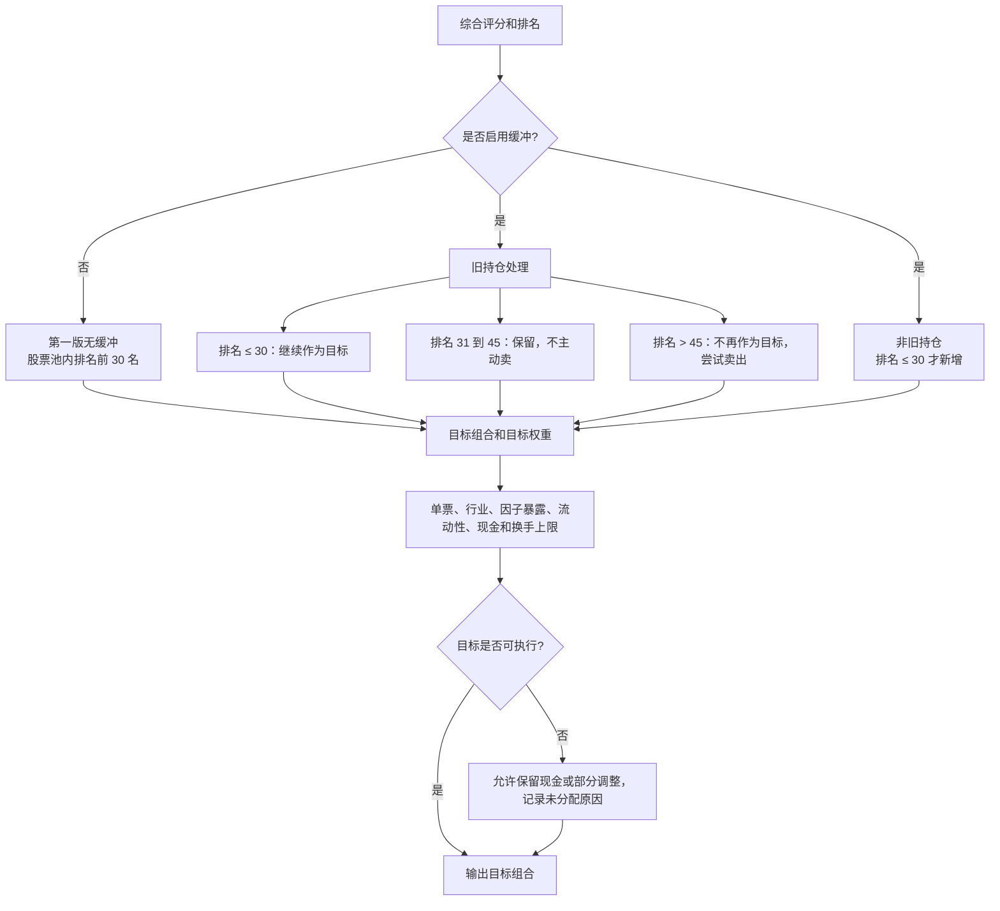

矩阵中的“前 30 名”和“排名 31 到 45”必须使用同一个排名尺度。换手上限默认按单边口径；首次建仓是否豁免是独立配置，不能把目标权重当作必然实现的真实权重。

## 9. 信号到订单和 A 股撮合

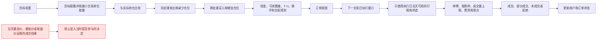

执行价格和成交规则必须在看到当天完整行情之前写死。日线级回测只能表达“开盘参考价和当日可交易状态”的近似撮合，不能假装知道盘中最高价和最低价。

## 10. 订单状态机

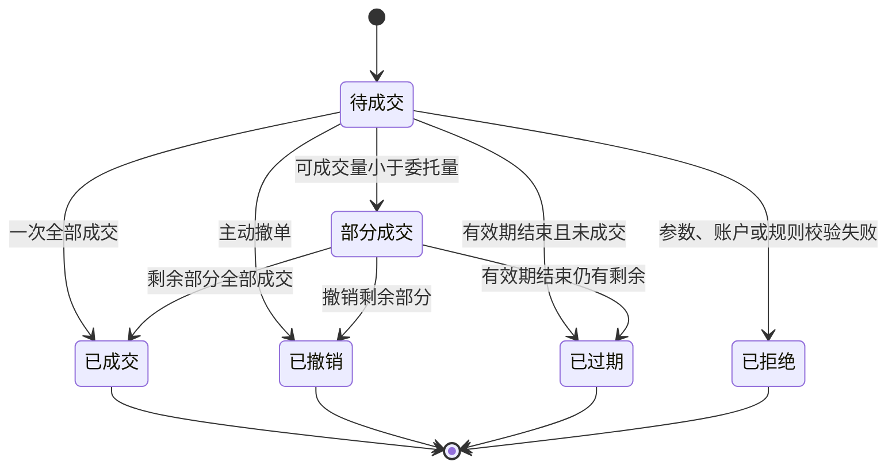

每笔订单至少记录：

```text
signal_time
order_time
fill_time
symbol
side
requested_price
filled_price
requested_volume
filled_volume
status
reject_reason
unfilled_reason
```

未成交订单不能无限重试。默认在下一个计划调仓日重新评估，月内重试必须由单独配置明确控制。

## 11. 账户、公司行动和每日估值闭环

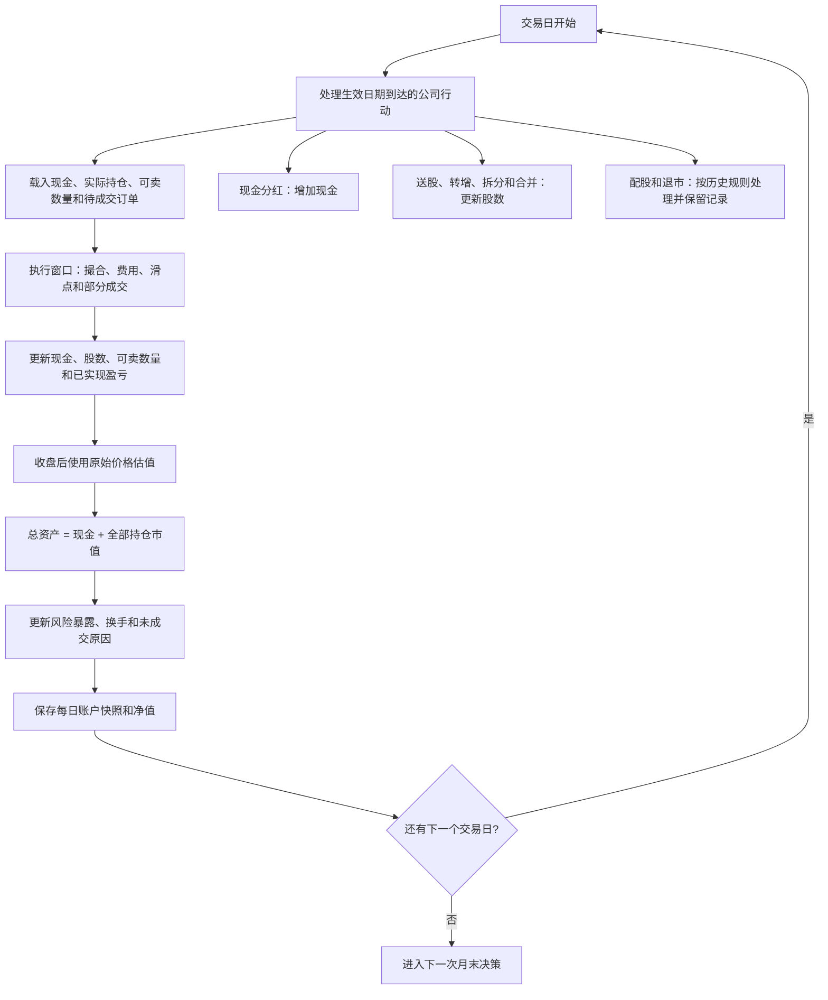

公司行动必须真正更新账户，不能只存在于数据清单中。因子使用明确的复权价格；成交和账户估值使用原始价格；分红送转不能再通过复权价格重复计算一次收益。

## 12. 月频标签、IC 和组合复盘

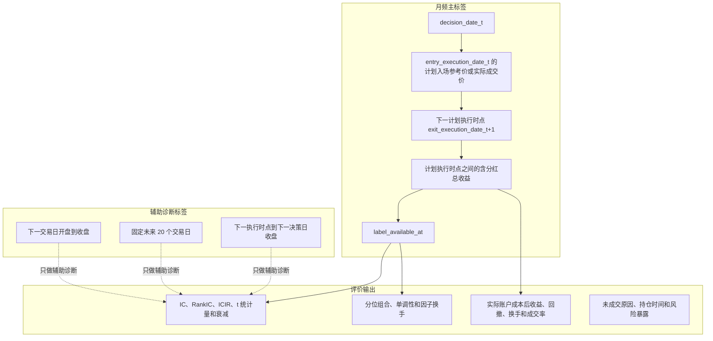

因子评价必须使用月频主标签或明确标注的辅助标签；组合收益必须来自真实账户和实际成交，不能假设目标权重一定成交。未来收益只用于标签和评价，不进入信号层。

## 13. 开发、验证和最终观察流程

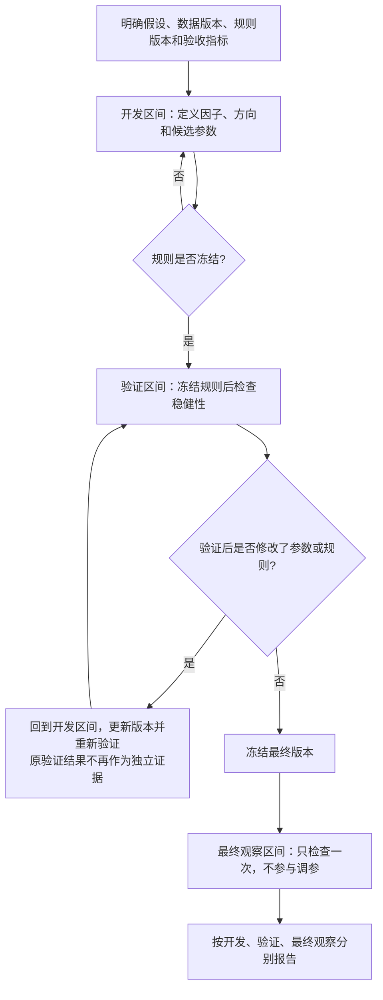

不允许用最终观察区间反复挑选参数、股票池或成本假设。成本提高、换手增加或样本缩短后结论明显不稳定时，应先回到数据、因子和执行问题，而不是继续增加模型复杂度。

## 14. 从工程基线到后续策略的路线

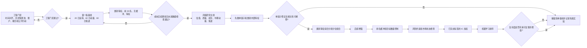

推进顺序是“工程基线 -> 月频研究主线 -> 后续增强”。因子越多、优化器越复杂，不会自动带来更可信的策略；只有数据、标签、撮合和成本链路稳定后，复杂度才有讨论价值。

## 15. 模块映射和运行闭环

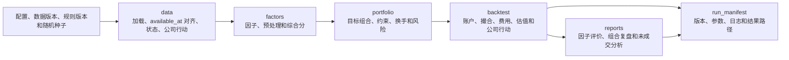

第一版可以压缩为四个模块：

```text
data.py        数据加载、时间对齐和公司行动
factors.py     因子计算、预处理和综合分
portfolio.py   目标组合、约束和订单意图
backtest.py    账户、撮合、估值和报告
```

无论代码如何拆分，稳定接口必须保持分层：

```text
策略层输出目标组合和理由
组合层输出订单意图
执行层负责成交、未成交和账户更新
账户层负责现金、股数、可卖数量和估值
评价层只使用已经完整的标签和真实账户结果
```

## 16. 一页式验收路径

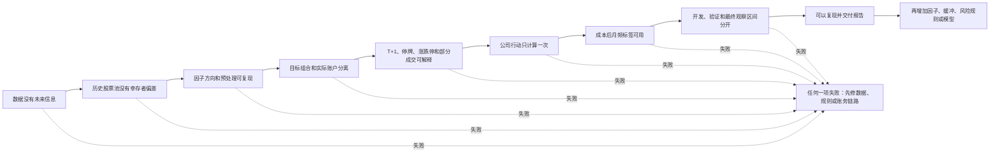

## 17. 关键不变量

这些条件不随图形、模块或优化器变化：

```text
1. available_at <= as_of_time 才能进入当前决策。
2. label_available_at <= 当前 as_of_time 才能进入当前权重或训练。
3. 信号层不能使用次日停牌、封板或成交结果提前过滤。
4. 目标权重不等于真实持仓，目标成交不等于真实成交。
5. 卖不出的持仓继续占用资金和风险额度。
6. 因子使用复权口径，成交和估值使用原始价格，公司行动只处理一次。
7. 每个订单必须保留状态、成交量、价格和拒绝或未成交原因。
8. 月内每个交易日都必须更新账户、估值和风险暴露。
9. 回测必须报告成本后结果，并注明换手是单边还是双边口径。
10. 开发、验证和最终观察区间不能混用。
11. 数据版本、规则版本、因子版本、配置版本和随机种子必须进入运行清单。
12. 没有明确授权和仿真验证，不连接真实账户，不发送真实订单。
```
